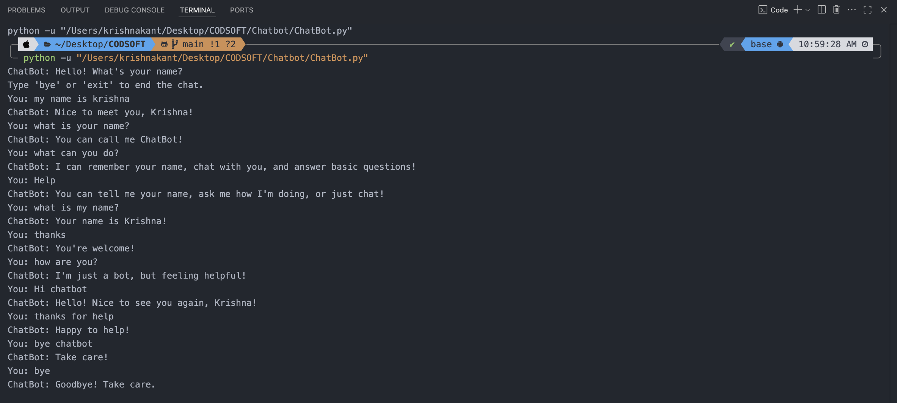
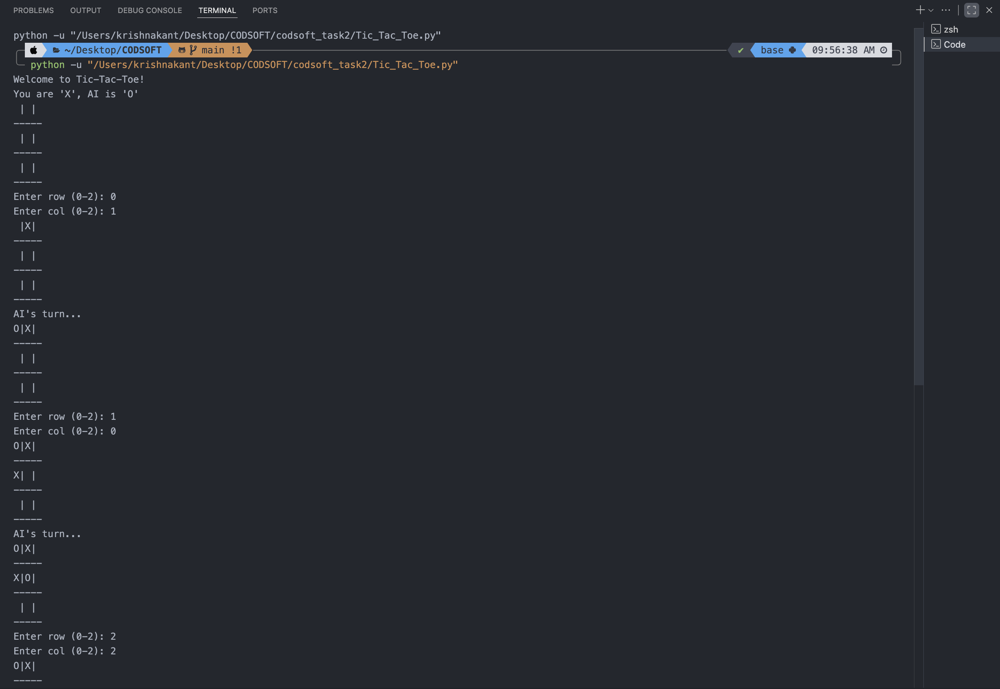
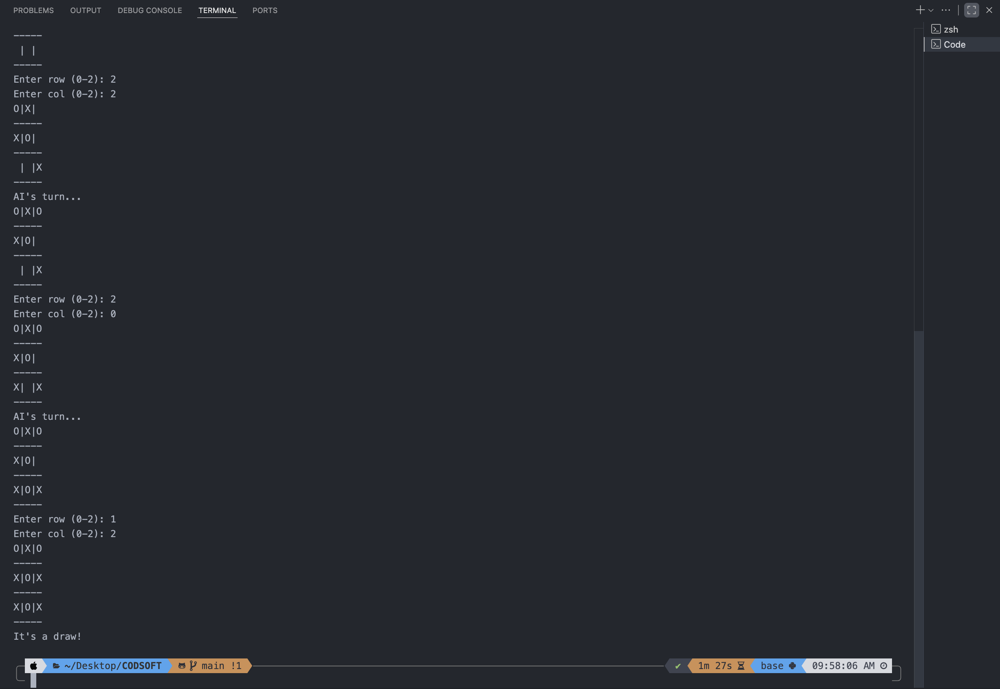
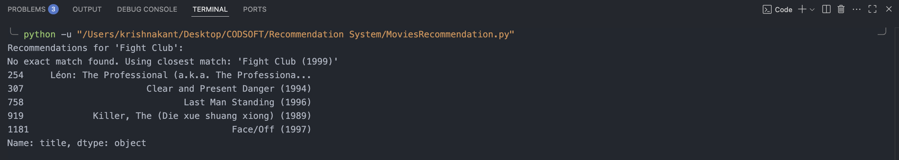
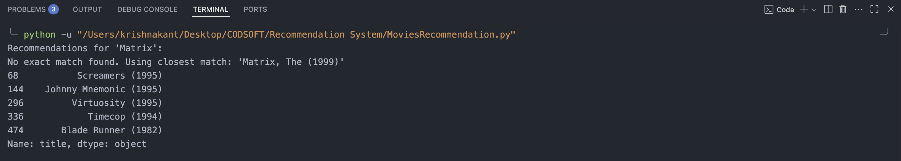

# 🚀 CODSOFT Artificial Intelligence Internship Projects

This repository contains my submissions for the **Artificial Intelligence Internship** offered by [CODSOFT](https://www.codsoft.in).  
I have completed the following three tasks:

1. **Chatbot with Rule-Based Responses**
2. **Movie Recommendation System**
3. **Face Detection & Recognition** (Using `face_recognition` & ArcFace)

---

## 📂 Repository Structure

---

## 📌 **Task 1: Chatbot with Rule-Based Responses**

### 🔹 Overview

A simple chatbot created using Python that responds to user inputs based on predefined rules.  
It uses **if-else conditions** and **string matching** to detect user intent and respond accordingly.

### 🛠 Features

- Handles basic greetings and small talk
- Uses keyword detection for responses
- Simple text-based interface

### 📷 Screenshot

---

## 📌 **Task 2: Tic-Tac-Toe AI (Minimax with Alpha-Beta Pruning)**

### 🔹 Overview

An **unbeatable Tic-Tac-Toe AI** that plays optimally using the **Minimax Algorithm** with **Alpha-Beta Pruning** for efficiency.  
The AI ensures that the human player cannot win, only draw or lose.

### 🛠 Features

- Human vs AI gameplay
- Minimax algorithm for decision-making
- Alpha-Beta pruning to optimize search
- Text-based interface

### 🧠 How It Works

1. Represent the Tic-Tac-Toe board as a list.
2. The AI evaluates all possible moves using **Minimax**.
3. **Alpha-Beta pruning** skips branches that cannot influence the final decision.
4. The AI always plays the optimal move.

### 📷 Screenshot

---

## 📌 **Task 4: Movie Recommendation System**

### 🔹 Overview

A **content-based recommendation system** that suggests movies similar to a given movie title.  
It uses **TF-IDF Vectorization** and **Cosine Similarity** to compare movie descriptions.

### 🛠 Features

- Suggests top 5 similar movies
- Works on text-based description similarity
- Uses Scikit-learn for vectorization & similarity calculation

### 🧠 How It Works

1. **Load Dataset** → Movies with title & description.
2. **Vectorization** → Convert text descriptions into numerical vectors using `TfidfVectorizer`.
3. **Similarity Calculation** → Compute cosine similarity between movies.
4. **Recommendation** → Suggest top N most similar movies.

### 📷 Screenshot

---

## 📌 **Task 5: Face Detection & Recognition**

### 🔹 Overview

This project detects and recognizes faces in images/videos using:

1. **`face_recognition` library** (Dlib-based)
2. **ArcFace model** (InsightFace)

---

### 🛠 Features

- Detect faces in real-time or from images
- Compare faces with known dataset
- Recognize faces with high accuracy

---

### 📍 **Method 1: face_recognition**

- Uses **HOG + CNN-based face detection**.
- Encodes known faces and compares with input images.
- Works well for small datasets & real-time webcam input.

---

### 📍 **Method 2: ArcFace**

- Uses **deep learning embeddings** for face recognition.
- More robust against lighting, angles, and age changes.
- Suitable for large datasets and higher accuracy.

---

### 📷 Screenshots

**face_recognition Output:**  

**ArcFace Output:**  

---

## 🛠 Technologies Used

- **Python**
- **OpenCV**
- **face_recognition (Dlib)**
- **ArcFace (InsightFace)**
- **Scikit-learn**
- **Pandas**
- **NumPy**

---

## 📹 Demo Videos

You can view the demonstration videos for each task on my LinkedIn profile:  
🔗 [My LinkedIn](https://www.linkedin.com/in/krishna-kant-singh-gu3013/)

---

## 🔗 Connect With Me

- 📧 Email: *kabhinav577@gmail.com*
- 💼 LinkedIn: [linkedin.com/in/krishna-kant-singh-gu3013](https://www.linkedin.com/in/krishna-kant-singh-gu3013/)
- 💻 LeetCode: [leetcode.com/u/Mr_Robot_12/](https://leetcode.com/u/Mr_Robot_12/)
- 🌐 Portfolio: [krishnakant-singh.vercel.app/](https://krishnakant-singh.vercel.app/)

---

## 📌 Internship Tags

`#codsoft` `#internship` `#AIproject` `#Python` `#ArtificialIntelligence` `#MachineLearning`
